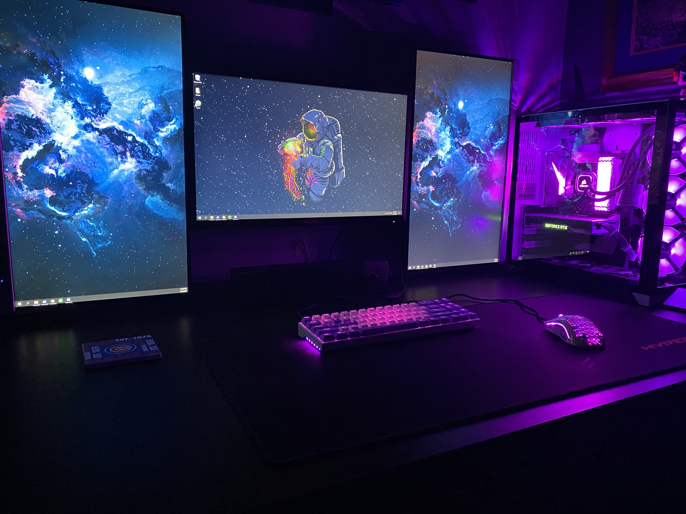
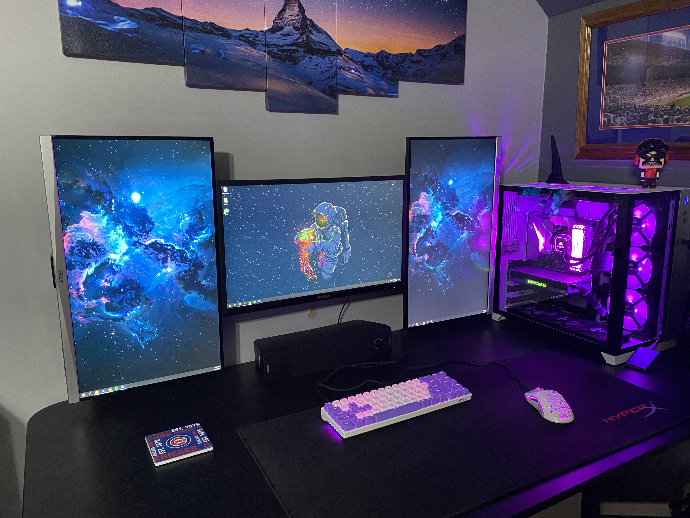

# my-projects
Projects that I have completed for various classes to use for my resume. 
This repository has all of my completed projects for different classes from intro to computers all the way to mobile application development and database systems. 

# My Computer Setup
- __Parts__:
  - ASUS ROG Strix z370-e
  - Intel Core i5 8600k
    - Corsair H150i AIO
  - Nvidia RTX 2070
  - Corsair Vengeance White RGB 32GB 3200MHz
  - 2 TB Seagate Barracuda HDD
  - 500 GB Samsung Evo 850
  - 250 GB Samsung Evo 850
  - EVGA Supernova 850 G3

